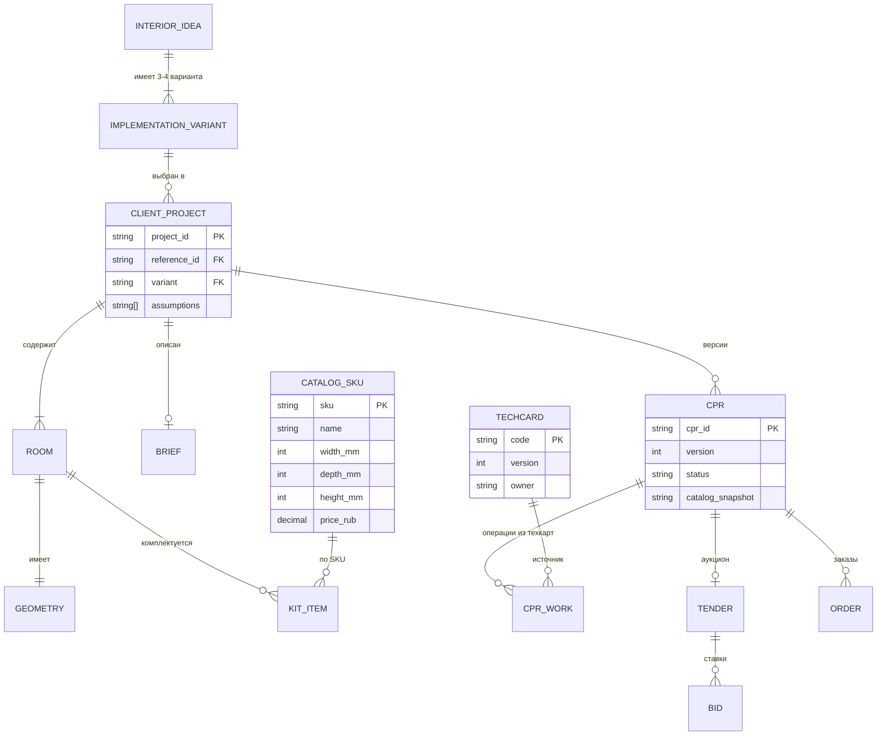

# ER-диаграмма UDS

```mermaid
erDiagram
  INTERIOR_IDEA ||--|{ IMPLEMENTATION_VARIANT : "имеет 3-4 варианта"
  IMPLEMENTATION_VARIANT ||--o{ CLIENT_PROJECT : "выбран в"
  CLIENT_PROJECT ||--|{ ROOM : "содержит"
  CLIENT_PROJECT ||--o| BRIEF : "описан"
  ROOM ||--|| GEOMETRY : "имеет"
  ROOM ||--o{ KIT_ITEM : "комплектуется"
  CATALOG_SKU ||--o{ KIT_ITEM : "по SKU"
  CLIENT_PROJECT ||--o{ CPR : "версии"
  CPR ||--o{ CPR_WORK : "операции из техкарт"
  TECHCARD ||--o{ CPR_WORK : "источник"
  CPR ||--o| TENDER : "аукцион"
  TENDER ||--o{ BID : "ставки"
  CPR ||--o{ ORDER : "заказы"
  CLIENT_PROJECT {
    string project_id PK
    string reference_id FK
    string variant FK
    string[] assumptions
  }
  CPR {
    string cpr_id PK
    int version
    string status
    string catalog_snapshot
  }
  CATALOG_SKU {
    string sku PK
    string name
    int width_mm
    int depth_mm
    int height_mm
    decimal price_rub
  }
  TECHCARD {
    string code PK
    int version
    string owner
  }
```

Соответствие JSON Schema: `CLIENT_PROJECT` > `client`, `ROOM` > `rooms[]`, `KIT_ITEM` >
`specification`, `CPR` > корень, `CPR_WORK` > `rooms[].works`, `TENDER` > `tender`.
